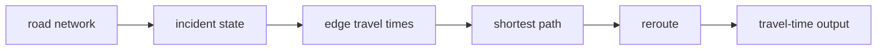

# Architecture

## Road model
Directed edges carry base travel time, incident delay, and closure state.

## Incident layer
Disruption changes effective edge cost or removes the edge.

## Router
Dijkstra finds the current minimum-travel-time path.

## Output
Returns route and total travel minutes for auditability.

## Principle
Make incident effects explicit in edge costs so route changes can be explained.
